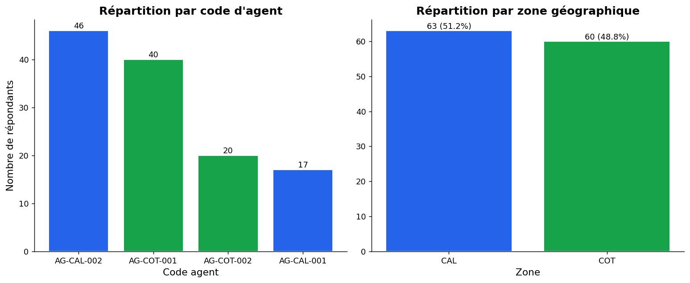
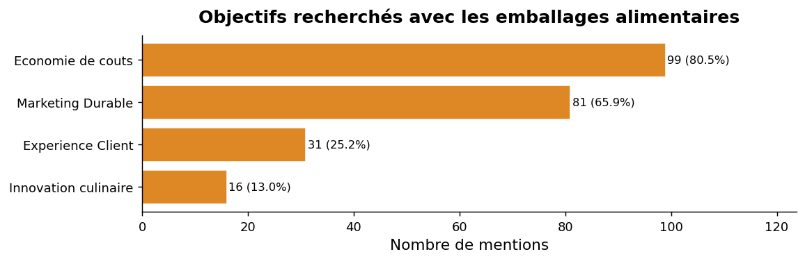
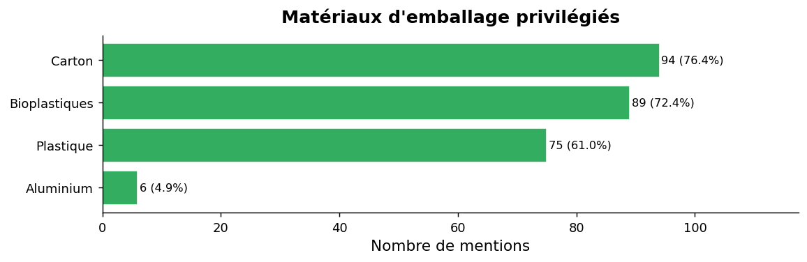
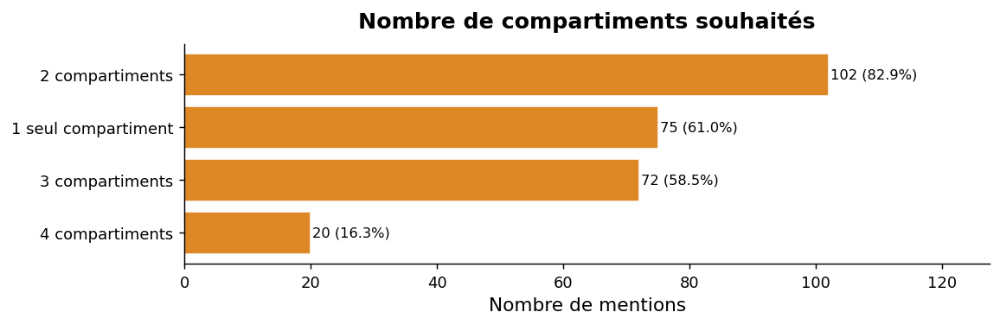
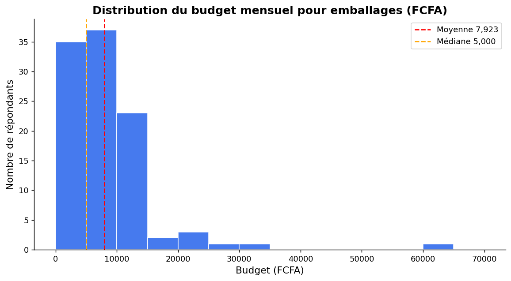
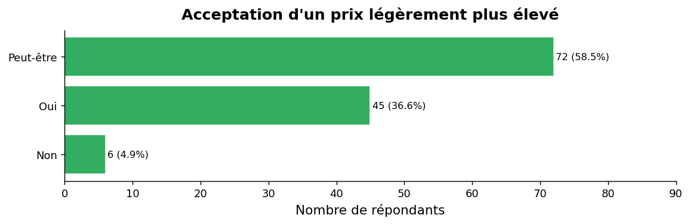
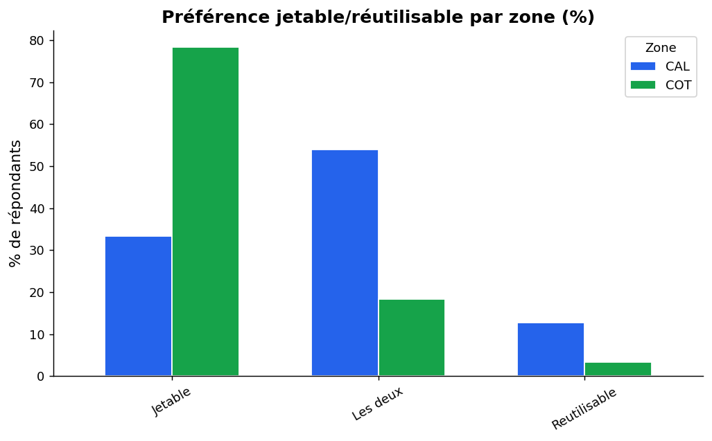

#  Rapport d'Analyse : Étude de Marché des Emballages Alimentaires Jetables

**Date:** 12 Mars 2026  
**Auteur:** Bedel OLOUKPONA  
**Sujet:** Analyse des besoins, préférences et attentes des professionnels de la restauration concernant les emballages jetables.

---

## 📌 1. Introduction & Contexte
Ce rapport synthétise l'étude de terrain menée auprès de **123 restaurateurs et vendeurs de rue**, répartis sur les secteurs de Cotonou (**COT**) et d'Abomey-Calavi (**CAL**).

L'objectif principal est de guider le lancement d'une nouvelle gamme d'emballages alimentaires jetables en s'appuyant sur des données probantes (matériaux, taille, nombre de compartiments, sensibilité au prix et fréquence de livraison).

---

## 👥 2. Aperçu de l'Échantillon Mère

L'étude s'est concentrée majoritairement sur des points de vente à flux réguliers, dominés par la vente de **Mets africains** (nécessitant souvent des plats chauds et de la sauce).

*Observation : L'échantillon est parfaitement équilibré, avec 51% des répondants situés à Calavi et 49% à Cotonou, garantissant une bonne représentativité géographique.*

---

## 🎯 3. Les Attentes Fondamentales des Clients

### A. Pourquoi utilisent-ils des emballages ?
100% des sondés utilisent actuellement des emballages. Leurs deux moteurs principaux lors de l'achat sont :
1. **L'Économie de coûts** (80.5% des mentions)
2. **Le Marketing Durable** (65.9%)

### B. Le Choix du Matériau
Les professionnels expriment le besoin de s'éloigner du plastique pur :
- **Le Carton durci (76%)** et le **Bioplastique (72%)** sont les matériaux les plus plébiscités, confirmant la tendance du marché vers l'éco-responsabilité.

### C. Caractéristiques Techniques Indispensables
La nourriture vendue étant souvent chaude ou liquide, les attentes fonctionnelles ne trompent pas :
1. **Résistance à la chaleur** (90% des vendeurs la réclament absolument).
2. **Sécurité alimentaire** (63%).
3. De plus, 79% des répondants exigent la présence d'une **fenêtre transparente** pour visualiser le contenu sans ouvrir le plat.

---

## 📐 4. Format et Design Parfait (Le Plat "Star")

En croisant les questions sur la taille, le volume et le compartimentage, le produit idéal (MVP - Minimum Viable Product) se dessine très clairement de la manière suivante :

- **Taille :** *Grand format* (95% des demandes).
- **Contenance :** *1100 ML* (Format principal, très adapté aux portions africaines). L'arrondi à 800 ML est perçu en seconde position.
- **Compartimentage :** *2 compartiments* (afin de séparer systématiquement l'accompagnement de la sauce/protéine).

---

## 💰 5. Analyse Financière et Positionnement Tarifaire

C'est ici que se joue la rentabilité du projet Cinnuex. L'élasticité prix a été mesurée avec soin.

### A. Le Budget Actuel
Le budget médian de la cible est de **5 000 FCFA par mois**. 
Cependant, l'analyse révèle qu'une portion non négligeable d'acteurs denses dépense jusqu'à 10 000 FCFA. Le prix moyen dépensé actuellement pour acquérir *une centaine de plats* se situe autour de 3 500 à 4 500 FCFA.

### B. Acceptation d'un Nouveau Prix
Les usagers sont-ils prêts à payer plus cher vos emballages ? **Oui, sous conditions de rentabilité indirecte (Zéro perte/Zéro fuite).**
*   **58.5%** disent "Peut-être" (à convaincre via des échantillons gratuits qualitatifs).
*   **36.6%** répondent un grand "Oui" affirmé, tant que la résistance à la chaleur est validée.

---

## 📍 6. Analyse Croisée : Cotonou vs Calavi

L'étude montre une dichotomie intéressante entre les deux secteurs géographiques. Vos commerciaux ne devront pas employer le même discours dans l'une et l'autre zone :

1. **Pouvoir d'Achat :** Les vendeurs de **Cotonou (COT)** disposent d'un budget alloué aux emballages presque deux fois supérieur à celui de Calavi (CAL). (Moy. 10 800 FCFA à COT vs 5 700 FCFA à CAL).
2. **Comportement :** Cotonou cherche une solution 100% Jetable (rapide et efficace), tandis que Calavi penche massivement vers des solutions "Mixtes" (Jetable + options lavables/réutilisables).

---

## 💡 7. Plan Stratégique d'Action (Recommandations )

Sur la base de ces 123 témoignages, voici la marche à suivre pour garantir un lancement réussi :

### 🚀 Axe 1 : Développement Produit
Ne perdez pas de temps à lancer de nombreux modèles. Concentrez votre investissement R&D sur un **Plat grand format (1100 ML), composé d'un fond en carton éco-responsable, séparé en 2 compartiments**, et fermé par **un couvercle hermétique ultra-résistant de préférence transparent**. Ce modèle couvrira plus de 80% des besoins organiques identifiés.

### 💸 Axe 2 : Tarification et Positionnement (Pricing)
Visez un prix public conseillé de **5 000 à 6 000 FCFA pour la centaine** de jetables premium.
Vous vous situez dans une "zone premium abordable". Évitez de brader le produit : justifiez ces 1 500 FCFA de surcoût par la promesse *"Gagnez du temps et protégez vos clients des brûlures/fuites"* (argumentaire de la Résistance à la Chaleur).

### 📦 Axe 3 : Distribution et Satisfaction Client
Organisez un système de **livraison hebdomadaire** (exigence de plus de la moitié des sondés). 
**Le petit plus qui fait la différence (issu des remarques qualitatives) :** Branchez un outil informatique qui envoie systématiquement un petit rappel par **WhatsApp ou SMS** la veille de la livraison. C'est le service client très attendu qui fidélisera à coup sûr cette cible professionnelle très occupée.

---

